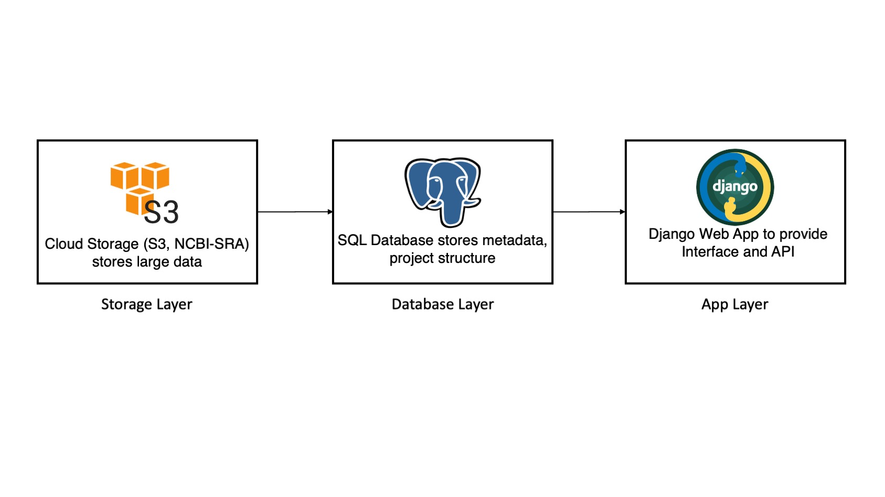
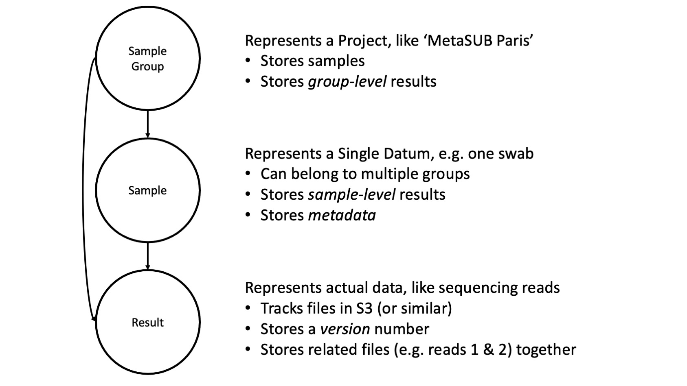

Architecture
============

Overview
^^^^^^^^

   Pangea is, ultimately, a wrapper over cloud storage services like S3. It uses a PostGres database to track project structure, metada, and file URIs. A Django Web App and React front end provide an interface to the database.

Pangea is a Content Management System for the life sciences. Data for the life sciences is composed of large files that can be grouped into analyses, samples, and projects all of which contain significant metadata. Pangea provides an practical interface to store, manage, and access this data.

Pangea consists of a Django App that provides a RESTful API to a PostGres database. This database is used to store project structure and metadata for ready access. For large files (which are common) the database provides linking to and from cloud storage services like S3 and the NCBI-SRA database.

Pangea also provides a python API to interact with a remote endpoint of the RESTful API and a React-TypeScript client. 

Data Model
^^^^^^^^^^

Core Data Model
---------------

Pangea employs a simple data model that can support a variety of use cases. The core of this data model is a Sample. Samples represent a singular physical object like a biopsy or swab. Samples contain metadata which records details that researchers deem important for their experiments, common examples include date of collection, processing technician, and more.

   Simplified data model for Pangea. Samples are grouped into Sample-Groups. Both Samples and Sample-Groups can contain Analysis-Results.

To group samples into projects Pangea supports Sample-Groups. Sample-Groups are quite literally just groups of samples. Samples may belong to many different groups to support different analyses and sub-group analyses with the only restrictions being related to privacy. The only exception to this are Sample Libraries (often called just Libraries in our documentation). Sample Libraries are also Sample Groups but have a special property that every sample must belong to exactly one Sample Library. This library is, in effect, the sample's home-base.

The real strength of Pangea is its ability to connect data and analyses to samples. Samples contain Analysis-Results which represent either raw data from the sample or results derived from analysis of that data. An example of this could be the raw reads from paired-end DNA sequencing of a sample. The raw reads would be stored as an Analysis-Result with two Analysis-Result-Fields, one each for the forward and reverse reads. Each Field could point to a file stored on the cloud or, for results that require less storage, be stored directly in Pangea.

Sample-Groups may also contain Analysis-Results. In this case Analysis-Results are used to represent anything that applies to all the samples at once. An example would be a pairwise distance matrix between all samples in a dataset.

Analysis-Results may contain multiple replicates of the same type and each Analysis-Result may contain a list of the other Analysis-Results it was derived from. This helps to ensure provenance of each result and reproducible research.

Full Data Model
---------------

.. figure:: _static/slides/full_data_model.jpeg
   :width: 600

   Full data model for Pangea. Analysis-Results can contain separate fields. All samples must be in exactly one Library (but can be in any number of non-library Sample-Groups). Users and Organizations provide authentication and control.

As implemented Pangea uses an enhanced data model. THis model provides additional utilities for organization and management. 

Contrib Modules
^^^^^^^^^^^^^^^

Pangea supports contrib modules that provide non-core functionality. This is meant to allow development of specific biological applications without affecting the core codebase.

Code Layout
^^^^^^^^^^^

Overall setup is Django standard. All core modules may be found in ``pangea/core``, contrib modules are found in ``pangea/contrib/<module_name>``. Tests are located in ``pangea/core/tests`` and ``pangea/contrib/<module_name>/tests``

